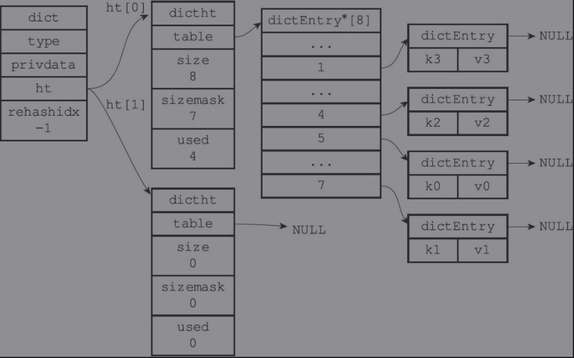

## 概括
字典，又称为符号表(symbol table)，关联数据(associative array)或者映射(map),用于保护键值对的数据结构。
字典中的每个key都是独一无二的，程序可以根据key来查找、更新、删除与之对应的值

## 实现
redis的字典使用hash表作为底层实现，一个hash表里面可以有多个hash表节点（entry），每个entry保存一个键值对。

### 字典
字典结构定义(dict.h/dict)

~~~
typedef struct dict {
    //类型
    dictType *type;
    //私有数据
    void *privdata;
    //hash表，数组大小为2，正常情况下用ht[0]，rehash时用到ht[1]
    dictht ht[2];
    //rehash的索引，rehash不在运行时，rehashIdx的值为-1
    long rehashidx; 
    unsigned long iterators; /* number of iterators currently running */
} dict;
~~~

type属性和privdata属性是针对不同类型的键值对，type用于特定类型键值对的函数，privdata保存特定函数的可选参数

ht属性，包含2个项的数组，每项都是dictht hash表，正常情况下，使用ht[0],rehash时用ht[1];

普通状态下（没有进行rehash）的dict

### hash表
hash表结构定义（dict.h/dictht）

~~~
typedef struct dictht {
    //hash表数据
    dictEntry **table;
    //hash表大小
    unsigned long size;
    //hash表大小掩码，用户计算索引，值总是等于size-1
    unsigned long sizemask;
    //hash表已有节点数
    unsigned long used;
} dictht
~~~

table是一个数组，数组的每个元素是dictEntry结构的指针，每个dictEntry保存一个键值对；

size记录hash表的table数组大小

used记录已有节点（键值对）数量，sizemask则与key的hash值一起决定一个键应该放在table数组的哪个索引上

### hash表 Entry
hash表键值对用dictEntry结构定义(dict.h/dictEntry)

~~~
typedef struct dictEntry {
    //键
    void *key;
    //值
    union {
        void *val;
        uint64_t u64;
        int64_t s64;
        double d;
    } v;
    //指向下个entry节点，当多个key hash&sizemask值一样时，则组成链表
    struct dictEntry *next;
} dictEntry;
~~~
key属性保存键值对中的键

v属性保存键值对中的值，值可以是一个指针，或者unit64_t整数，或者int64_t整数；

next属性指向另一个hash entry的指针，将多个hash值相同的键值对连接在一起，解决冲突的问题。

### rehash操作
hash表的键值对数量随着操作的运行，不断的增多或者减少，为了让hash表的负载因子（load factor）维持一个合理的范围值，
需要对hash表进行扩容或者缩容操作。

hash表的负载因子计算：

~~~
load_factor=ht[0].used/ht[0].size
~~~

#### 扩容
扩容需要满足指定条件之一：

1. 服务器没有执行bgsave或者bgrewritraof命令，且load_factor>=1;
2. 服务器在执行bgsave或者bgrewritraof命令，load_factor>=5;

满足任意一个条件都将执行扩容操作。

假设当前没有执行bgsave或者bgrewritraof命令，ht[0].size=4,ht[0].used=4,load_factor=4/4=1,满足扩容条件，
size要满足2的次幂，当前size=4，即将扩容的size=4*2=8，满足2的次幂，所以程序将ht[1]的size设置为8。

 ht[1]初始化后如下图

将ht[0]的4个dictEntry重新计算hash到ht[1]中

释放ht[0]，并将ht[1]设置为ht[0]，然后为ht[1]分配一个空白哈希表；并把ht[1]的table设置为null；

即完成一次rehash扩容操作。

#### 缩容
当load_factor<0.1时，则触发缩容条件，ht[1].size=ht[0].size/2，并且满足2的次幂;

### 渐进式 hash
当1个dict的size较小时，一次rehash操作很快完成，但如果size达到千万，甚至过亿时，要将ht[0] 所有的entry rehash 到ht[1]所需的庞大计算量，会导致一段时间不能提供服务。

为了避免这种影响，分多次，渐进式的将ht[0]的entry rehash到ht[1]是非常好的解决方案。

渐进式rehash的详细步骤：

1.  为ht[1]分配空间，让字典同时持有ht[0]和ht[1]两个哈希表。

2. 在dict中维护的索引计数器变量 rehashidx，将它的值设置为0，表示rehash工作正式开始。

3. 在rehash进行期间，每次对字典执行添加、删除、查找或者更新操作时，程序除了执行指定的操作以外，还会顺带将ht[0]哈希表在rehashidx 索引上的所有键值对rehash到ht[1]，当rehash工作完成之后，程序将rehashidx++。

4. 随着字典操作的不断执行，最终在某个时间点上，ht[0]的所有键值对都会被rehash至ht[1]，这时程序将rehashidx属性的值设为-1，表示rehash操作已完成。

进行渐进式rehash的过程中，字典会同时使用ht[0]和ht[1]两个哈希表，在渐进式rehash进行期间，字典的删除（delete）、查找（find）、更新（update）等操作会在两个哈希表上进行。

例如，要在字典里面查找一个键的话，程序会先在ht[0]里面进行查找，如果没找到的话，就会继续到ht[1]里面进行查找，诸如此类。

另外，在渐进式rehash执行期间，新添加到字典的键值对一律会被保存到ht[1]里面，而ht[0]则不再进行任何添加操作，这一措施保证了ht[0]包含的键值对数量会只减不增，并随着rehash操作的执行而最终变成空表。

<!--more-->
---
