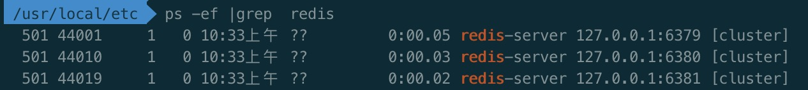

## redis集群部署
redis cluster集群要求三主三从提供服务，在做测试的时候，三主就可以使用。所以，我们基于三主来搭建一个没有高可用的测试用集群。

### 配置修改
redis安装完之后，复制一份配置文件目录到 /usr/local/etc/中。先复制一份redis-6379.conf

~~~
cp  redis.conf  redis-6379.conf
~~~

修改redis-6379.conf中几个参数：

logfile：日志文件目录，默认为空;

~~~
logfile "/usr/local/etc/logs/6379.log"
~~~

dbfilename：RDB文件的存储目录，默认当前文件夹，dump.rdb

~~~
dbfile "/usr/local/etc/data/dump-6379.rdb"
~~~

打开几个cluster参数配置文件，去掉前面的”#“注释

~~~
cluster-enabled yes
cluster-config-file nodes-6379.conf
cluster-node-timeout 15000
~~~

第一个配置文件准备好了。偷个懒，把配置文件复制多份

~~~
cp redis-6379.conf redis-6380.conf
cp redis-6379.conf redis-6381.conf
~~~

把复制出来的文件中端口号进行替换；

macOS下要用sed -i -e 才能替换成功，linux 下sed -i 就可以

~~~
sed -i -e "s/6379/6380/g" redis-6380.conf
sed -i -e "s/6379/6381/g" redis-6381.conf
~~~

替换之后检查对应的文件，确认无误

### 服务启动

~~~
redis-server /usr/local/etc/redis-6379.conf
redis-server /usr/local/etc/redis-6380.conf
redis-server /usr/local/etc/redis-6381.conf
~~~	

三个服务节点启动OK之后。通过

~~~
ps -ef |grep redis
~~~
检查redis是否启动OK。启动OK，便可以看到对应的进程。

### 状态检查
通过redis-cli -c -p \<port> 连接服务,-c 代表cluster模式，-p是对应的端口，默认6379；

~~~
redis-cli -c -p 6379
~~~
登录成功之后，查看cluster的状态

~~~
127.0.0.1:6379> cluster nodes
129448b2ae9eef32d28ab17c41e83e67fba2f665 :6379@16379 myself,master - 0 0 0 connected
~~~
### 节点加入
当前集群只有本身一个节点；通过cluster meet命令，加入其他节点

~~~
127.0.0.1:6379> cluster meet 127.0.0.1 6380
OK
127.0.0.1:6379> cluster nodes
e11d04de35d673968bb2f1425a4d408a36c5ae52 127.0.0.1:6380@16380 master - 0 1605667540643 0 connected
129448b2ae9eef32d28ab17c41e83e67fba2f665 127.0.0.1:6379@16379 myself,master - 0 0 1 connected
127.0.0.1:6379> cluster meet 127.0.0.1 6381
OK
127.0.0.1:6379> cluster nodes
e11d04de35d673968bb2f1425a4d408a36c5ae52 127.0.0.1:6380@16380 master - 0 1605667562873 0 connected
3c572432e859460975a1fbe1e578637944405ca2 127.0.0.1:6381@16381 master - 0 1605667561864 2 connected
129448b2ae9eef32d28ab17c41e83e67fba2f665 127.0.0.1:6379@16379 myself,master - 0 1605667560000 1 connected
~~~

将剩余节点加入进来了。查看集群状态，发现state还是fail，因为16384个槽还未分配。

~~~
127.0.0.1:6379> cluster info
cluster_state:fail
cluster_slots_assigned:0
cluster_slots_ok:0
cluster_slots_pfail:0
cluster_slots_fail:0
cluster_known_nodes:3
cluster_size:0
cluster_current_epoch:2
cluster_my_epoch:1
cluster_stats_messages_ping_sent:125
cluster_stats_messages_pong_sent:130
cluster_stats_messages_meet_sent:2
cluster_stats_messages_sent:257
cluster_stats_messages_ping_received:130
cluster_stats_messages_pong_received:127
cluster_stats_messages_received:257
~~~

### slot分配
分配槽可以通过 cluster addslots 来分配，不过在redis-cli客户端中，只能批量指定多个槽，无法范围分配

~~~
127.0.0.1:6379> CLUSTER ADDSLOTS 0 5000
OK
127.0.0.1:6379> cluster nodes
e11d04de35d673968bb2f1425a4d408a36c5ae52 127.0.0.1:6380@16380 master - 0 1605667882922 0 connected
3c572432e859460975a1fbe1e578637944405ca2 127.0.0.1:6381@16381 master - 0 1605667881000 2 connected
129448b2ae9eef32d28ab17c41e83e67fba2f665 127.0.0.1:6379@16379 myself,master - 0 1605667882000 1 connected 0 5000
~~~
上门只是分配了第0个和第5000个槽给6379这个节点，如果想要范围分配，可以通过redis-cli 直接执行命令

~~~
redis-cli -p <port> -c  cluster addslots {<start>..<end>}
~~~
如果设置了密码，再增加 -a 参数。至于范围用 *{}* 包围起来，*start 从0开始，end最大值为16383*；

~~~
root> redis-cli -p 6379 -c  cluster addslots {1..4999}
OK
redis-cli -p 6379 -c
127.0.0.1:6379> cluster nodes
e11d04de35d673968bb2f1425a4d408a36c5ae52 127.0.0.1:6380@16380 master - 0 1605668017221 0 connected
3c572432e859460975a1fbe1e578637944405ca2 127.0.0.1:6381@16381 master - 0 1605668018227 2 connected
129448b2ae9eef32d28ab17c41e83e67fba2f665 127.0.0.1:6379@16379 myself,master - 0 1605668017000 1 connected 0-5000

root> redis-cli -p 6380 -c -a 6e1KWyC29w cluster addslots {5001..10000}
OK
redis-cli -p 6380 -c
127.0.0.1:6380> cluster nodes
129448b2ae9eef32d28ab17c41e83e67fba2f665 127.0.0.1:6379@16379 master - 0 1605668412843 1 connected 0-5000
3c572432e859460975a1fbe1e578637944405ca2 127.0.0.1:6381@16381 master - 0 1605668411833 2 connected
e11d04de35d673968bb2f1425a4d408a36c5ae52 127.0.0.1:6380@16380 myself,master - 0 1605668412000 0 connected 5001-10000

root> redis-cli -p 6381 -c cluster addslots {10001..16383}
OK
redis-cli -p 6380 -c -a 6e1KWyC29w
127.0.0.1:6380> cluster nodes
129448b2ae9eef32d28ab17c41e83e67fba2f665 127.0.0.1:6379@16379 master - 0 1605668457297 1 connected 0-5000
3c572432e859460975a1fbe1e578637944405ca2 127.0.0.1:6381@16381 master - 0 1605668458308 2 connected 10001-16383
e11d04de35d673968bb2f1425a4d408a36c5ae52 127.0.0.1:6380@16380 myself,master - 0 1605668456000 0 connected 5001-10000
127.0.0.1:6380> cluster info
cluster_state:ok
cluster_slots_assigned:16384
cluster_slots_ok:16384
cluster_slots_pfail:0
cluster_slots_fail:0
cluster_known_nodes:3
cluster_size:3
cluster_current_epoch:2
cluster_my_epoch:0
cluster_stats_messages_ping_sent:928
cluster_stats_messages_pong_sent:980
cluster_stats_messages_sent:1908
cluster_stats_messages_ping_received:979
cluster_stats_messages_pong_received:928
cluster_stats_messages_meet_received:1
cluster_stats_messages_received:1908
~~~
以上集群便部署完毕了，当然，这只是自己玩的小demo，没有高可用性。

每个master没有slave节点，如果任何一个master停止对外提供服务，没有slave能切换。整个集群也就不可用。